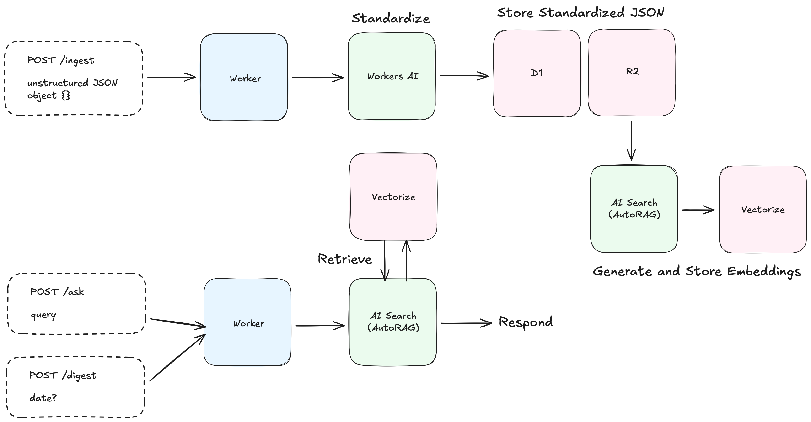
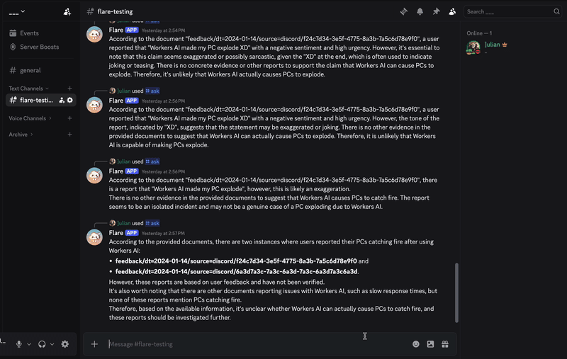
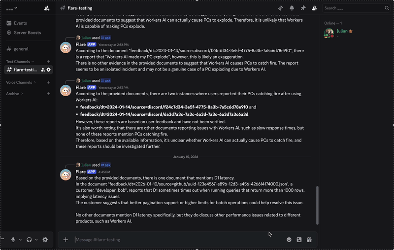

# Feedback Analyzer

**AI-powered feedback intelligence for product teams.**

A Discord bot + HTTP API that ingests scattered feedback (support tickets, Discord, GitHub, etc.), normalizes it using Workers AI, and provides semantic search and daily digests via AI Search RAG. Built entirely on the Cloudflare Developer Platform.

---

## 🎯 What Problems Does This Solve?

- **Scattered data**: Feedback comes from Discord, GitHub, support, Twitter, email—all in different formats
- **Theme extraction**: Hard to spot patterns and urgency across 100+ daily feedback items
- **Context retrieval**: "What have customers said about D1 performance?" requires manual search
- **PM insights**: Daily digests with sentiment breakdowns, urgency samples, and AI-generated themes

---

## 🔗 Live Demo

**Deployed Worker:**  
🔗 [https://feedback-analyzer.juelzlax.workers.dev](https://feedback-analyzer.juelzlax.workers.dev)

**Discord Bot Intall Link:**  
🔗 [https://discord.com/oauth2/authorize?client_id=1459585837292458024](https://discord.com/oauth2/authorize?client_id=1459585837292458024)

**GitHub Repository:**  
🔗 [https://github.com/julez14/feedback-analyzer](https://github.com/julez14/feedback-analyzer)

**Demo Video:**

[Video Overview](https://youtu.be/_3EA9o92gao)

---

## ✨ Core Features

### 🔄 `/ingest` – Normalize & Store Feedback

- Accepts raw feedback from any source (Discord message, GitHub issue, support ticket JSON)
- **Workers AI** analyzes content and extracts:
  - Product area (`workers`, `d1`, `r2`, `auth`, etc.)
  - Sentiment (`positive`, `neutral`, `negative`)
  - Urgency (`low`, `medium`, `high`, `p1`)
  - Tags (`bug`, `feature-request`, `docs`, etc.)
- Stores **standardized JSON** in **R2** (for AI Search indexing)
- Writes canonical row to **D1** (for fast stats queries)

### 🔍 `/ask` – Semantic Search (RAG)

- Discord slash command: `/ask query:"What are users saying about D1 performance?"`
- Queries **AI Search** to find relevant feedback using vector similarity
- Returns AI-generated summary with citations
- Works via Discord bot or HTTP API

### 📊 `/digest` – Daily Summary

- Discord slash command: `/digest date:2025-01-14` (optional; defaults to today)
- Combines:
  - **AI Search**: Semantic themes and representative examples
  - **D1**: Deterministic stats (counts by source/sentiment, high-urgency samples)
- Outputs PM-friendly digest with sentiment emoji breakdown and key insights

---

## 🏗️ Architecture

### Diagram



```
┌─────────────────┐
│   Discord Bot   │
│  Slash Commands │
└────────┬────────┘
         │
         ▼
┌─────────────────────────────────────┐
│    Cloudflare Worker (index.ts)     │
│  Routes: /interactions, /ingest,    │
│          /ask, /digest              │
└─┬─────────┬─────────┬─────────┬────┘
  │         │         │         │
  │         │         │         │
  ▼         ▼         ▼         ▼
┌────┐  ┌────┐   ┌────┐   ┌────────┐
│ AI │  │ D1 │   │ R2 │   │AI Search│
│    │  │    │   │    │   │  (RAG) │
└────┘  └────┘   └────┘   └────────┘
```

### Cloudflare Products Used

1. **Workers** – Single Worker hosts Discord interaction handler + HTTP API routes
   - _Why:_ Serverless, auto-scaled, zero-config deployment
2. **Workers AI** – Standardization and summarization (Llama 3.1 8B Instruct)
   - _Why:_ Extracts product area, sentiment, urgency from unstructured text without external LLM costs
3. **R2** – Object storage for standardized feedback JSON documents
   - _Why:_ Serves as the "corpus" for AI Search; durable, low-cost storage for raw documents
4. **AI Search (AutoRAG)** – Semantic search + retrieval-augmented generation
   - _Why:_ Handles vector embeddings, indexing, and RAG automatically; no manual vectorization needed
5. **D1** – Serverless SQL database for structured feedback rows
   - _Why:_ Fast deterministic queries for digest stats (counts by source/sentiment/urgency)

---

## 💭 Design Decisions

Below are some design decisions made during development:

### Q: Should the daily digest be scheduled or manual for MVP?

**Decision:** Implement `/digest` as a manual command now, with a note "cron scheduled next."
**Why:** Scheduling adds complexity and isn't required to demonstrate the core product value in an MVP.

### Q: Should I use AI Search or build directly on a vector DB?

**Decision:** Use Cloudflare AI Search for the MVP.
**Why:** It reduces "vector plumbing" and makes it easier to ship a reliable RAG demo quickly, while still allowing differentiation via your standardization step and PM-style outputs.

### Q: Does AI Search automatically convert D1 rows into embeddings?

**Decision:** No—treat D1 and AI Search as separate layers and explicitly index documents into AI Search (via its configured data source).
**Why:** AI Search indexes content from connected sources (not "watching" D1 tables by default), so you need an ingestion/indexing path that feeds the RAG corpus.

### Q: Should I skip standardization and just store raw JSON in R2 as the source of truth?

**Decision:** Don't skip it—do standardization (or "standardization-lite") even if R2 is your main store.
**Why:** Without standardization, analytics and even RAG quality become inconsistent because the "true feedback text" lives in different fields across platforms; standardization is also the core product insight of the prompt.

### Q: What write format should I use in R2 (per-item JSON vs daily NDJSON)?

**Decision:** Use per-item JSON objects with date/source prefixes for MVP.
**Why:** NDJSON "append" patterns introduce concurrency coordination (often requiring a serializer), while per-item objects are simpler and safer under parallel ingestion.

### Q: Should the Discord bot use mentions or slash commands?

**Decision:** Use slash commands for the MVP.  
**Why:** It's simpler and more reliable to implement within the timebox; mentions add extra moving parts and risk.

### Q: What should the system architecture look like?

**Decision:** One Cloudflare Worker hosts the Discord interaction handler and the HTTP API routes, and it talks to bound services (Workers AI + D1 + R2 + AI Search).
**Why:** A single Worker keeps deployment and debugging simple and makes the architecture screenshot/description clearer for the submission.

### Q: What are my D1 querying needs (to design tables + indexes)?

**Decision:** Optimize D1 for time-window queries and breakdowns used by digests and PM analytics (by date, source, product area, sentiment, urgency), plus fast "recent items" retrieval.
**Why:** RAG is handled by AI Search, while D1 powers deterministic counts/trends and "what changed" style analysis that makes the tool feel PM-built.

---

## 📄 Data Model

### Standardized Feedback Schema

All feedback is normalized into this canonical JSON structure (TypeScript interface):

```typescript
interface Feedback {
	id: string; // UUID
	created_at: string; // ISO 8601 timestamp
	source: 'discord' | 'github' | 'support' | 'twitter' | 'email';
	source_url?: string; // Original URL if available
	product_area: 'auth' | 'billing' | 'workers' | 'ai' | 'workers-ai' | 'd1' | 'r2' | 'other';
	title?: string; // Short summary headline (max 100 chars)
	author?: string; // Username or identifier
	thread_id?: string; // Thread/issue ID
	body_text: string; // Main feedback text
	sentiment: 'positive' | 'neutral' | 'negative';
	urgency: 'low' | 'medium' | 'high' | 'p1';
	tags: string[]; // e.g., ["bug", "feature-request", "performance"]
	confidence?: {
		product_area?: number; // 0-1 confidence score
		sentiment?: number;
		urgency?: number;
	};
}
```

### R2 Object Key Convention

Feedback is stored in R2 using a date-partitioned structure for easy indexing:

```
standardized/dt=2025-01-14/source=discord/<uuid>.json
standardized/dt=2025-01-14/source=github/<uuid>.json
standardized/dt=2025-01-15/source=support/<uuid>.json
```

**Why this structure?**

- Date prefixes (`dt=YYYY-MM-DD`) enable efficient daily digest queries
- Source prefixes help with analytics breakdowns
- Per-item JSON objects avoid concurrency issues with append-style writes

---

## 🚀 Setup & Local Development

### Prerequisites

- **Node.js**: v18 or later
- **Cloudflare Account**: [Sign up for free](https://dash.cloudflare.com/sign-up)
- **Wrangler CLI**: Installed via `npm install` (included in package.json)

### Installation

```bash
# Clone the repository
git clone https://github.com/julez14/feedback-analyzer.git
cd feedback-analyzer

# Install dependencies
npm install
```

### Configure Cloudflare Bindings

Edit `wrangler.jsonc` to set up your bindings:

```jsonc
{
	"name": "feedback-analyzer",
	"main": "src/index.ts",
	"compatibility_date": "2025-09-27",

	// Workers AI binding
	"ai": {
		"binding": "AI"
	},

	// D1 database
	"d1_databases": [
		{
			"binding": "DB",
			"database_name": "feedback-data",
			"database_id": "YOUR-D1-DATABASE-ID",
			"migrations_dir": "migrations"
		}
	],

	// R2 bucket
	"r2_buckets": [
		{
			"binding": "BUCKET",
			"bucket_name": "feedback"
		}
	],

	// Environment variables
	"vars": {
		"DISCORD_PUBLIC_KEY": "YOUR-DISCORD-PUBLIC-KEY-HEX",
		"AI_SEARCH_NAME": "feedback-search",
		"MODEL_NORMALIZE": "@cf/meta/llama-3.1-8b-instruct",
		"MODEL_SUMMARIZE": "@cf/meta/llama-3.1-8b-instruct" // Used for further query result summarization if needed
	}
}
```

### Create Cloudflare Resources

```bash
# Create D1 database
npx wrangler d1 create feedback-data

# Apply migrations (creates `feedback` table)
npx wrangler d1 migrations apply feedback-data

# Create R2 bucket
npx wrangler r2 bucket create feedback

# Create AI Search index
# Note: AI Search indexes are created via Cloudflare Dashboard at:
# https://dash.cloudflare.com/?to=/:account/ai/ai-search
# Name it "feedback-search" and connect it to your R2 bucket (prefix: standardized/)
```

### Discord Bot Setup

1. Go to [Discord Developer Portal](https://discord.com/developers/applications)
2. Create a new application
3. Copy the **Public Key** (hex string) and set it as `DISCORD_PUBLIC_KEY` in `wrangler.jsonc`
4. Go to Bot tab → Reset Token → Copy the bot token (if needed for future features)
5. Enable "Message Content Intent" (Bot settings)
6. Install bot to your server:
   ```
   https://discord.com/api/oauth2/authorize?client_id=YOUR-APP-ID&permissions=2147485696&scope=bot%20applications.commands
   ```
7. Register slash commands:
   ```bash
   npm run register-commands
   ```
   _(This script uses Discord API to register `/ask` and `/digest` commands)_

### Environment Variables Summary

Set these in `wrangler.jsonc` under `vars`:

| Variable             | Description                                           | Example                          |
| -------------------- | ----------------------------------------------------- | -------------------------------- |
| `DISCORD_PUBLIC_KEY` | Discord app public key (hex) for request verification | `f2d69cf2d521...`                |
| `AI_SEARCH_NAME`     | Name of your AI Search index                          | `feedback-search`                |
| `MODEL_NORMALIZE`    | Workers AI model for feedback normalization           | `@cf/meta/llama-3.1-8b-instruct` |
| `MODEL_SUMMARIZE`    | Workers AI model for digest summaries                 | `@cf/meta/llama-3.1-8b-instruct` |

Binding names used in code:

- `AI` – Workers AI binding
- `DB` – D1 database binding
- `BUCKET` – R2 bucket binding

### Run Locally

```bash
# Start local dev server
npx wrangler dev

# Worker will be available at http://localhost:8787
```

**Note:** Local dev uses remote bindings (AI, D1, R2, AI Search) by default. To test Discord interactions locally, use a tool like [ngrok](https://ngrok.com/) to expose your localhost and update the Discord Interactions URL in the Developer Portal.

---

## 🚢 Deployment

### Deploy to Cloudflare Workers

```bash
# Deploy to production
npx wrangler deploy

# Your worker will be live at:
# https://feedback-analyzer.juelzlax.workers.dev
```

### Set Discord Interactions URL

After deploying, configure Discord to send interactions to your Worker:

1. Go to [Discord Developer Portal](https://discord.com/developers/applications) → Your App → General Information
2. Set **Interactions Endpoint URL**:
   ```
   https://feedback-analyzer.juelzlax.workers.dev/interactions
   ```
3. Discord will send a PING request to verify the endpoint (your Worker handles this automatically)

### Verify Deployment

```bash
# Health check
curl https://feedback-analyzer.juelzlax.workers.dev/

# Should return:
# {"status":"ok","service":"feedback-analyzer","endpoints":["/interactions","/ingest","/ask","/digest"]}
```

---

## 💻 Example Usage

### Discord Slash Commands

**Ask a question:**



**Get daily digest:**



### HTTP API Examples

**Ingest raw feedback:**

```bash
curl -X POST https://feedback-analyzer.juelzlax.workers.dev/ingest \
  -H "Content-Type: application/json" \
  -d '{
    "id": "discord-msg-123456",
    "source": "discord",
    "author": "alice#1234",
    "content": "I love Workers AI but the @cf/meta/llama-3.1-8b-instruct model is timing out on long prompts. Can we get a fix?",
    "timestamp": "2025-01-14T10:30:00Z"
  }'
```

Response:

```json
{
	"success": true,
	"id": "discord-msg-123456",
	"created_at": "2025-01-14T10:30:00Z",
	"r2_key": "standardized/dt=2025-01-14/source=discord/discord-msg-123456.json",
	"normalized": {
		"source": "discord",
		"product_area": "workers-ai",
		"sentiment": "neutral",
		"urgency": "medium",
		"title": "Workers AI model timeout on long prompts",
		"tags": ["bug", "workers-ai", "performance"]
	}
}
```

**Query feedback (RAG):**

```bash
curl -X POST https://feedback-analyzer.juelzlax.workers.dev/ask \
  -H "Content-Type: application/json" \
  -d '{"query": "What are the top feature requests for R2?"}'
```

**Generate digest:**

```bash
curl -X POST https://feedback-analyzer.juelzlax.workers.dev/digest \
  -H "Content-Type: application/json" \
  -d '{"date": "2025-01-14"}'
```

### Ingesting Sample Data

Use the provided script to populate your feedback database with realistic test data:

```bash
# Run sample ingestion script
npx tsx scripts/ingest-sample.ts

# This will create ~20-30 sample feedback items across different sources,
# product areas, and sentiment/urgency levels
```

---

## 🎯 Limitations & Next Steps

### Current Limitations

- **Manual trigger**: `/digest` requires a user to invoke it (no scheduled automation yet)
- **No deduplication**: Same feedback from multiple sources isn't automatically merged
- **Basic sentiment analysis**: Single-pass LLM classification (no multi-model ensemble)
- **No PII detection**: User names and content are stored as-is

### Planned Enhancements

#### 🔄 Scheduled Digests

- **Use Cloudflare Workflows or Cron Triggers** to auto-generate daily digests
- Post to Discord channel every morning (e.g., 9 AM UTC)
- _Why:_ PMs shouldn't have to remember to run `/digest` manually

#### 🧠 Better Deduplication & Clustering

- **Use Vectorize** to detect near-duplicate feedback across sources
- Cluster similar feedback into "topics" (e.g., "D1 Performance Issues")
- _Why:_ 10 people saying "D1 is slow" should be treated as one theme, not 10 separate items

#### 🔐 Admin Controls & PII Redaction

- **Workers AI + pattern matching** to detect and redact emails, API keys, etc.
- Role-based access control for `/digest` (e.g., only PMs can run it)
- _Why:_ Protect customer privacy and prevent accidental leaks

#### 👍 Evaluation & Feedback Loop

- Add "Was this helpful? 👍 👎" reactions to `/ask` responses
- Store evaluation data in D1 and use it to tune RAG prompts
- _Why:_ Continuously improve answer quality based on PM feedback

#### 📈 Analytics Dashboard

- **Workers + Pages** frontend showing trends over time
- Visualizations: sentiment over time, product area heatmap, urgency distribution
- _Why:_ Some insights are easier to spot visually than in text digests

#### 🔗 Real Integrations

- Direct ingest from Discord (message listener), GitHub webhooks, Zendesk API
- _Why:_ Currently requires manual `/ingest` calls; real integrations eliminate this step

---

## 📚 Additional Resources

- [Cloudflare Workers Docs](https://developers.cloudflare.com/workers/)
- [Workers AI](https://developers.cloudflare.com/workers-ai/)
- [AI Search (AutoRAG)](https://developers.cloudflare.com/ai-search/)
- [D1 Database](https://developers.cloudflare.com/d1/)
- [R2 Object Storage](https://developers.cloudflare.com/r2/)
- [Design Decisions](docs/Design_Decisions.md)

---

**Built for the Cloudflare PM Intern Assignment** | January 2026
[Submission Document](https://docs.google.com/document/d/17E2OgwkzNVr5ua2TpQ_nkPPLT9gBHVsn27D92WWm5Wg/edit?usp=sharing)
